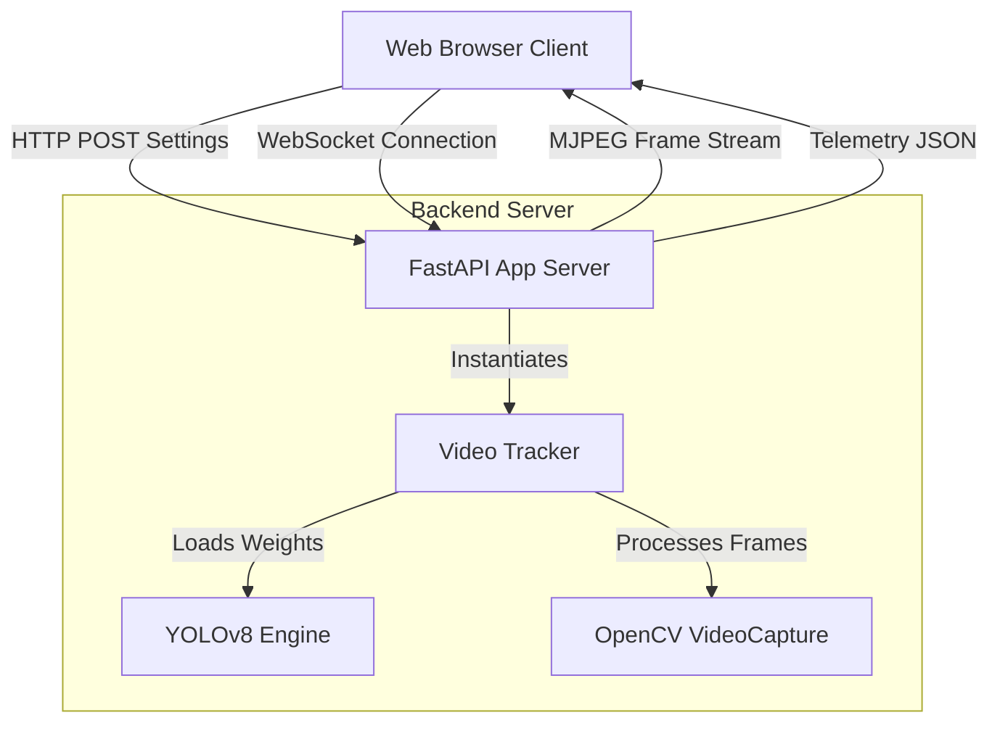

# AerialMOT: Multi-Object Video Streaming & Tracking Dashboard

AerialMOT is a web-based, real-time Multi-Object Tracking (MOT) system designed specifically for aerial and drone surveillance imagery. It pairs deep learning object detectors (**YOLOv8**) with multi-object tracking engines (**ByteTrack** and **BoT-SORT**) inside a lightweight web framework (**FastAPI**), displaying telemetry and video feeds through a responsive analytics dashboard (**Chart.js**).

---

## 🏗️ Architecture & Component Overview

The application follows a client-server architecture designed to handle high-throughput image frames and real-time dashboard updates:

### 1. Web Application Layer (`app.py`)
Built using **FastAPI**, this module orchestrates the server actions, endpoints, and file management:
* **Jinja2 Templates & Static Assets**: Serves the front-end layout and handles assets (CSS, JavaScript).
* **Streaming Response Engine**: Streams live annotated video frames using the Motion JPEG (MJPEG) protocol (`multipart/x-mixed-replace`).
* **WebSocket Server**: Maintains a persistent connection to broadcast real-time metrics (latency, FPS, active track count, and class distribution counts) to the front-end on every processed frame.
* **State Management**: Dynamically routes and updates tracking configurations (switching between the base YOLO model and the VisDrone finetuned model, adjusting confidence thresholds, or swapping tracking algorithms) mid-stream.

### 2. Deep Tracking Core (`tracker.py`)
Responsible for frame-by-frame inference, object detection, ID assignment, and visual annotations:
* **Object Detection Engine**: Integrates **YOLOv8** (from Ultralytics) to identify objects in drone footage. It maps VisDrone classes (such as `pedestrian`, `people`, `bicycle`, `car`, `van`, `truck`, `tricycle`, `awning-tricycle`, `bus`, `motor`).
* **Multi-Object Tracking (MOT)**: Implements **ByteTrack** (for high-speed frame association) and **BoT-SORT** (for tracking accuracy under moving camera conditions) via configuration YAML files.
* **Trail Visualization**: Computes bounding box centroids and maintains a temporal history array (`track_history`) to draw trailing paths behind objects.
* **Hardware Autodetect**: Automatically configures and routes workloads to use **Apple Silicon GPUs (MPS)** or **NVIDIA GPUs (CUDA)** when available, falling back to CPU when necessary.

### 3. Model Finetuning Pipeline (`train.py`)
A command-line script to customize and train models:
* Provides parameters for batch sizes, image dimensions, epoch duration, and dataset paths.
* Automatically uses Apple Metal (MPS) or CUDA to train models on the VisDrone dataset using `data.yaml`.
* Saves trained checkpoint weights under `runs/detect/train/weights/best.pt`.

### 4. Interactive Dashboard Frontend (Next.js + Tailwind CSS)
A modern, component-driven, responsive user interface built in the `frontend` folder and synced as a static export to the FastAPI server:
* **React Architecture**: Refactored into clean, modular sub-components:
  * [Sidebar](file:///Users/anusha/Desktop/Multi-Object-Tracking-In-Vedio-Streaming/frontend/src/components/Sidebar.tsx): Navigation, live telemetry widget (FPS, Latency, Bitrate, Resolution), and connection state.
  * [SettingsDrawer](file:///Users/anusha/Desktop/Multi-Object-Tracking-In-Vedio-Streaming/frontend/src/components/SettingsDrawer.tsx): Form controls to dynamically adjust tracker settings, switch models, set speed limit alerts, toggle heatmaps, and handle custom video uploads.
  * [ActiveTracksTable](file:///Users/anusha/Desktop/Multi-Object-Tracking-In-Vedio-Streaming/frontend/src/components/ActiveTracksTable.tsx): Live-updating datagrid showing tracking IDs, confidence, position, speed, and real-time speeding violation statuses.
  * [RecentEvents](file:///Users/anusha/Desktop/Multi-Object-Tracking-In-Vedio-Streaming/frontend/src/components/RecentEvents.tsx): A notification pane showing entry, exit, and speed alert occurrences.
  * [TimelineChart](file:///Users/anusha/Desktop/Multi-Object-Tracking-In-Vedio-Streaming/frontend/src/components/TimelineChart.tsx): Interactive Chart.js timeline showing historical metrics for active tracks and accuracy.
* **Tailwind CSS Styling**: Utilizes Tailwind CSS utility classes and design variables for seamless light/dark mode transitions, modern glassmorphism panels, and smooth micro-animations.

---

## 🔄 Data & Processing Flow

On every execution cycle, the system runs through the following workflow:

1. **Initialization**: The user uploads a video file or selects the default video, configures the settings, and clicks **Start Stream**.
2. **Video Ingestion**: The server instantiates the `VideoTracker` and initializes OpenCV's `VideoCapture` to read frames sequentially.
3. **Inference & Tracking**:
   * The frame is passed to the active YOLO model.
   * Detections are routed through the selected tracker (ByteTrack or BoT-SORT), which returns coordinates, class indices, confidence scores, and persistent tracking IDs.
4. **Drawing Annotations**: The system draws bounding boxes, labels with IDs, and color-coded motion trails on the frame.
5. **Telemetry Calculation**: 
   * FPS is calculated based on processing times.
   * Detections are aggregated into class distribution totals.
6. **Streaming & Broadcasting**:
   * The annotated frame is JPEG-compressed and sent via the `/video_feed` MJPEG stream.
   * Telemetry stats are serialized to JSON and broadcasted to the front-end over the WebSocket channel.
7. **Client Rendering**: The browser displays the stream and feeds the JSON data into the Chart.js graphs, updating them in real-time.

---

## 🛠️ Technology Stack

* **Backend Web Framework**: FastAPI (Python)
* **Computer Vision**: OpenCV (Python), Ultralytics YOLOv8
* **Tracking Frameworks**: ByteTrack, BoT-SORT
* **Hardware Acceleration Support**: Apple Silicon MPS (Metal Performance Shaders) & NVIDIA CUDA
* **Frontend Framework**: Next.js 16 (React 19, TypeScript)
* **Styling**: Tailwind CSS v4
* **Data Visualization**: Chart.js (via `react-chartjs-2`)
* **Deployment/Containerization**: Docker, Git LFS (for large model weights), Hugging Face Spaces
